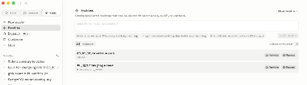
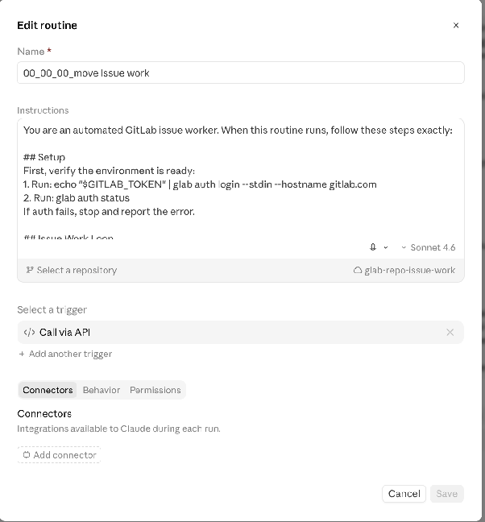
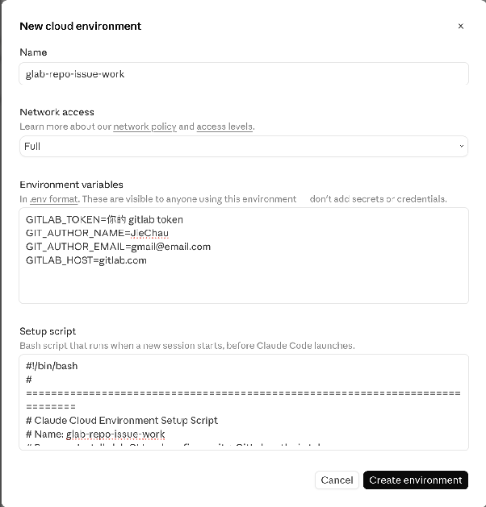

# claude-code-routines — Claude Code app Routines tutorial

A walkthrough of the **Routines** feature in the Claude Code app: scheduled / triggered
agents that run on a Claude-managed cloud VM (each routine gets its own Ubuntu box), so the
job runs in the cloud and your desktop doesn't have to stay on. This is documentation, not a
runnable snippet — there are no Python deps and no venv.

The example below builds a routine named `00_00_00_move issue work` that, on a schedule,
finds open GitLab issues, implements each on a feature branch, requires `pytest` to pass
before merging to `main`, then closes the issue. Two supporting files are referenced inline:

- [setup_script.txt](setup_script.txt) — environment setup script for the routine's cloud VM
  (installs `glab` + `uv`, authenticates `glab`, configures git).
- [instructions.txt](instructions.txt) — the routine's agent instructions (the issue-work loop).

---

Routines 它是原理就是 在雲端有一台 vm (一個 routine 會配一台 ubuntu) 然後在雲端跑，你的桌機就不必一直開著。

這裡有 2 個 routines, 一個是每天去找 00\_00\_00\_move 的 issue 然後解掉。另一個每天掃描新聞看有沒有優惠。說明 第一個。

第一個 routine 我把它取名字叫做 00\_00\_00\_move issue work  

(1) 第一步先要設定一個 vm 環境, 這個 vm 要能執行 python git glab uv run pytest  
我把這個環境取名字叫 glab-repo-issue-work (就是右邊中間有一朵小雲那個)   
你要先 create 它，這個環境設定，以後其他的 routine 可以重複使用  

Environment variables

GITLAB\_TOKEN=你的 gitlab token  
GIT\_AUTHOR\_NAME=JieChau  
GIT\_AUTHOR\_EMAIL=gmail@email.com  
GITLAB\_HOST=[gitlab.com](http://gitlab.com/)

Setup script

有點多，看附檔案 [setup\_script.txt](setup_script.txt) 

(2) 第二步 才是編輯 00\_00\_00\_move issue work 這個 routine

Instructions  
有點多，看附檔案 [instructions.txt](instructions.txt) 我這裡的內容有請它改完後，要 pytest 全過才能 merge

Select a trigger  
觸發方式 可以是 schedule 固定時間，或是 api call，或是 webhook 的事件。  
都可以

(3) 設定好了之後，用 右上角 'Run Now' 試試看。   
手動跑 run now 沒有次數限制，但是如果排程啟動 schedule 或 trigger 一天 ‘總共只能 5 次'
